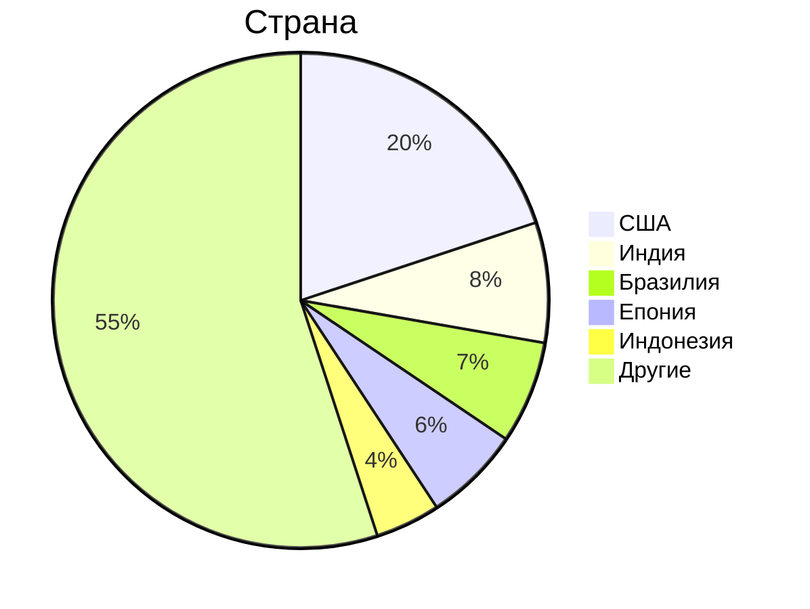
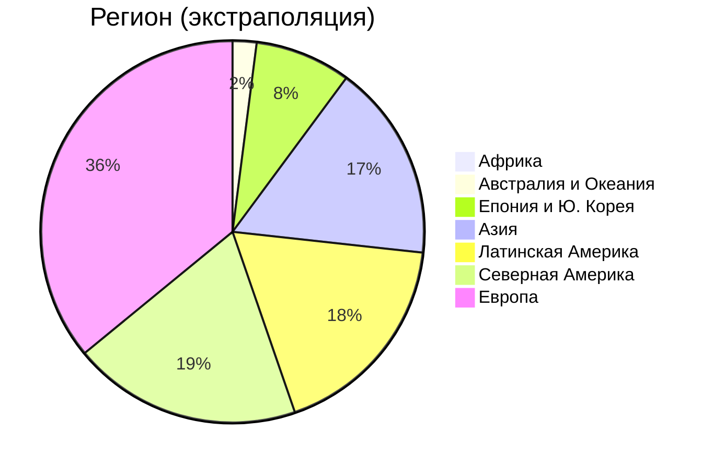
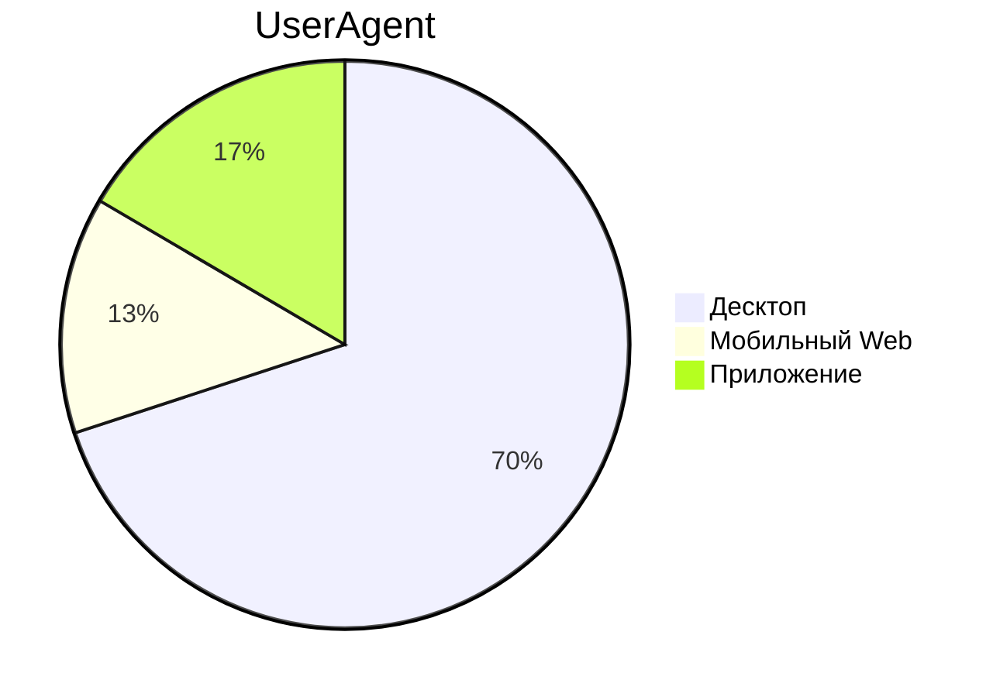
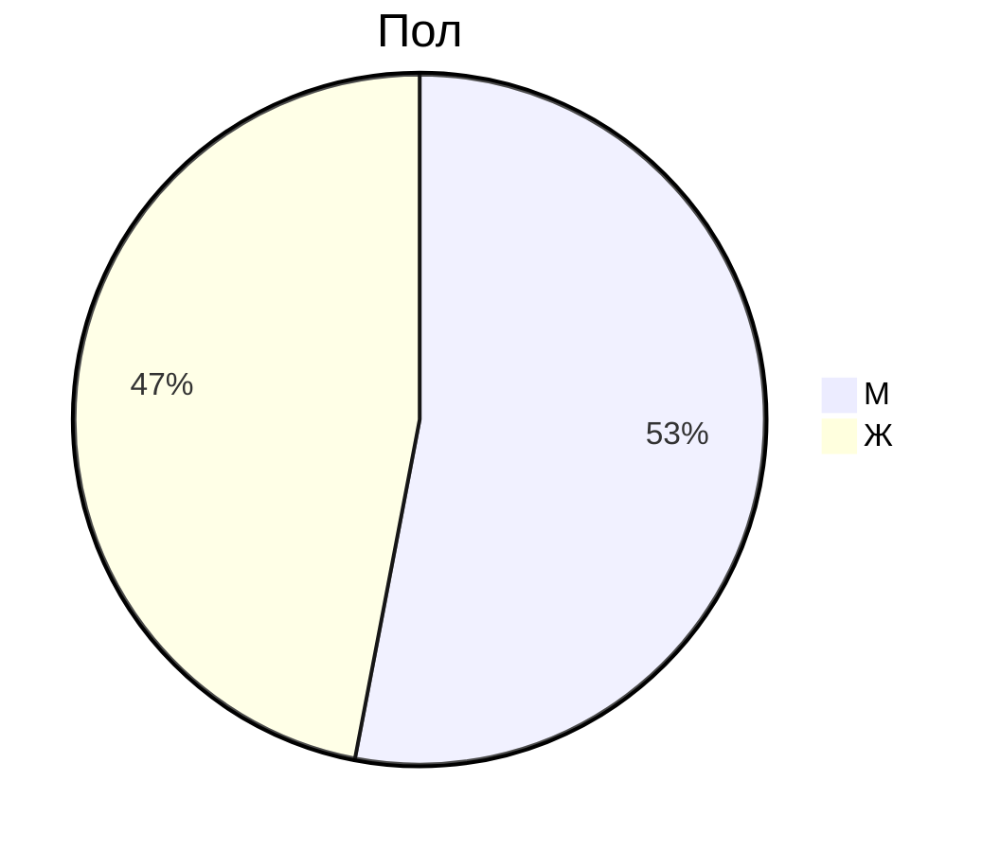

## Тема и целевая аудитория

Google Drive - облачное B2C и B2B хранилище файлов

### Минимальный функционал

- Загрузка файлов;
- Просмотр существующих файлов, их скачивание;
- Просмотр видео без скачивания (сжатого); просмотр фотографий без скачивания (сжатых);
- Управление доступом, sharing по ссылке;
- Поиск (по названию, по содержанию);
- Синхронизация файлов на ПК;
- Система ограничения доступного места.

### Целевая аудитория

Данные взяты с ExplodingTopics, SimilarWeb, HypeStat и некоторых других источников; несовпадающие значения усреднены.

| K                              | V    |
| ------------------------------ | ---- |
| MAU                            | 2.0B |
| DAU                            | 100M |
| Зарегистрировано пользователей | 2.8B |

Другой информации о географии ЦА я не нашёл.

#### Предположения о целевой аудитории

- В Китае сервис заблокирован;
- Сервис имеет популярность в развивающихся странах Азии (судя по присутствию Индии и Индонезии);
- Из-за развитых локальных аналогов и санкций сервис не очень популярен в России;
- Самый крупный конкурент - Microsoft OneDrive;
- В Европе сервис использует такая же доля людей, как в США, потому что в Европе
нет сильных локальных конкурентов и потому что экономики взаимосвязаны и похожи;
- Пользователей из Африки нет, потому что там слабо распространён интернет;
- В пределах одного региона во всех странах количество активных пользователей
на душу населения примерно одинаково.

#### Выделим в мире регионы

Пусть $N_i$ - население региона $i$, $A_i$ - количество активных пользователей (в пересчёте на MAU), а $\rho_i$ - количество активных пользователей на душу населения этого региона.

- Развивающиеся страны Азии (далее - Азия); $N_{Asia}\approx 2.6\ млрд$;
- Развитые страны Азии (далее - Епония); $N_{Japan}\approx0.19\ млрд$;
- Китай - нас не интересует;
- Европа - $N_{Europe}\approx 0.68\ млрд$;
- Центральная и Южная Америка - $N_{LA}\approx 0.62\ млрд$;
- Африка - $N_{Africa}\approx 1.1\ млрд$;
- Австралия и Океания - $N_{AU}\approx 0.038\ млрд$;
- Северная Америка - $N_{NA}\approx 0.36\ млрд$.

Здесь из населения Азии исключены Епония и Южная Корея, потому что эта страна значительно выделяется
среди других стран.

#### Рассчитаем $\rho_i$ для известных стран

$\rho_{Africa}\approx 0$ (на основании предположений о ЦА)

$\rho_{NA} \approx \frac{400\ млн}{330\ млн} \approx 1.18$ (на основании США для Северной Америки)

$\rho_{Japan}\approx \frac{120 млн}{120 млн}\approx 1$

$\rho_{Europe} \approx \rho_{AU} \approx \rho_{NA}=1.18$ (на основании предположений о ЦА)

$\rho_{LA}\approx\frac{140\ млн}{220\ млн}\approx0.636$ (на основании Бразилии)

$\rho_{Asia}\approx \frac{160\ млн + 80\ млн}{1.4\ млрд + 0.28\ млрд}\approx0.142$ (на основании Индии и Индонезии)

#### Экстраполируем $A_i$

$A_{Africa}\approx 0$

$A_{NA} \approx 0.43\ млрд$

$A_{Europe} \approx 0.80\ млрд$

$A_{AU} \approx 0.045\ млрд$

$A_{LA} \approx 0.4\ млрд$

$A_{Asia} \approx 0.37\ млрд$

> [!NOTE]
> Список источников находится в разработке, будет оформлен позже.

### Основные продуктовые метрики
