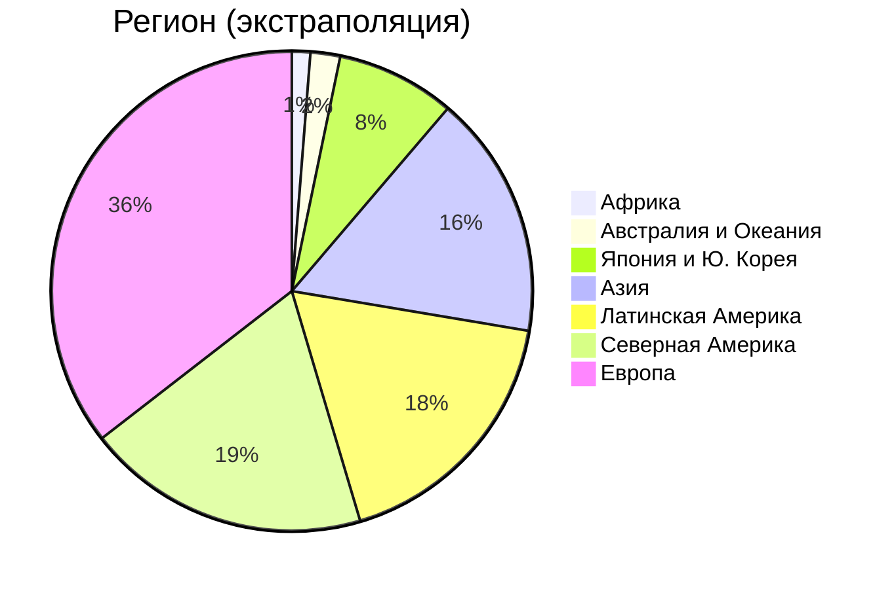
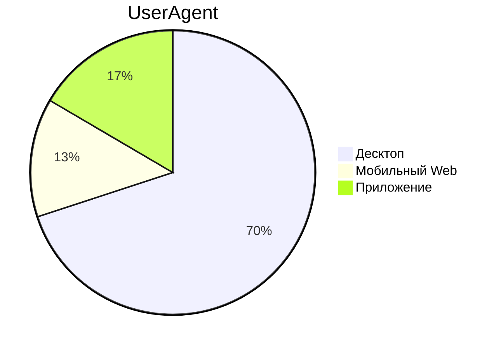
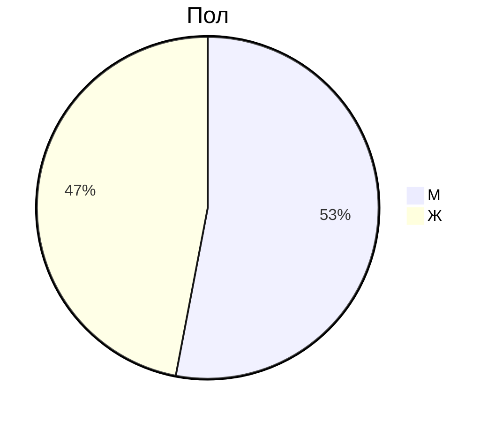

# 1. Тема и целевая аудитория

Google Drive - облачное B2C и B2B хранилище файлов

### Минимальный функционал

- Авторизация, регистрация;
- Загрузка файлов;
- Список последних файлов (стартовая страница);
- Просмотр существующих файлов, их скачивание;
- Предварительный просмотр медиаконтента;
- Управление доступом;
- Поиск;
- Система ограничения доступного места.

### Ключевые продуктовые решения

- Сжатие медиаконтента при предварительном просмотре из браузера;
- Для поиска индексируются тексты документов, субтитры видео, сканы изображений;
- Возможность просматривать, создавать и изменять архивы удалённо, без их скачивания
  (например, если надо в большой архив добавить один файл, пользователь присылает
  на сервер этот файл, а система автоматически дополнит архив);
- Возможность поделиться файлами по ссылке.

## Целевая аудитория

Данные взяты с HypeStat. [^1]

| K                              | V    |
| ------------------------------ | ---- |
| MAU                            | 2.0B |
| DAU                            | 100M |
| Зарегистрировано пользователей | 2.8B |

Другой информации о географии ЦА я не нашёл.
Имеющиеся данные были экстраполированы. [Ссылка на расчёт](calculations/regions.md)

# 2. Расчёт нагрузки

### Исходные данные

Месячная аудитория - 2.0 B; Дневная аудитория - 100 M

В 2022 году на Google Drive было загружено 250 млрд файлов, или 3.4 эксабайт. [^2]

64% опрошенных пользователей хранят на диске фотографии, 50% - документы, 44% - архивы, 35% - видео. [^3]

В среднем пользователь использует 3.9 гигабайт для хранения файлов. [^4]

Предположим, что в среднем пользователь скачивает все свои файлы раз в месяц.

Предположим, что 30% загружаемого контента - это видео, 20% - фотографии,
20% - архивы.

### Продуктовые метрики (в пересчёте на пользователя)

| Тип запроса             | Requests /User /Day           | Data /User /Day                  |
| ----------------------- | ----------------------------- | -------------------------------- |
| Добавление файла        | $3.4\cdot10^{-1}$ Reqs        | $4.7\cdot10^{0}$ Мб              |
| Скачивание файла        | $1.0 \cdot 10^1$ Reqs         | $1.2\cdot10^2$ Мб                |
| Просмотр медиаконтента  | 50 фотографий, 10 минут видео | $1.5\cdot10^2$ Мб (после сжатия) |
| Поиск                   | $1.0\cdot10^1$ Reqs           | Незначительный                   |
| Список последних файлов | $1.0\cdot10^1$ Reqs           | Незначительный                   |
| Управление доступом     | $1.0\cdot10^0$ Reqs           | Незначительный                   |

# Список источников

[^1]: https://hypestat.com/info/drive.google.com (дата обращения: 23.02.2025)
[^2]: https://web.archive.org/web/20240626222045/https://techreport.com/statistics/software-web/gmail-statistics/ (дата обращения: 23.02.2025)
[^3]: https://www.statista.com/forecasts/1011667/file-types-google-one-google-drive-in-the-us (дата обращения: 23.02.2025)
[^4]: Результаты опроса, проведённого автором среди 8 человек: https://docs.google.com/spreadsheets/d/1Ivwkm36-tmMWPxk_14mbQxpYs6oTPlgk/edit (дата обращения: 23.02.2025)
