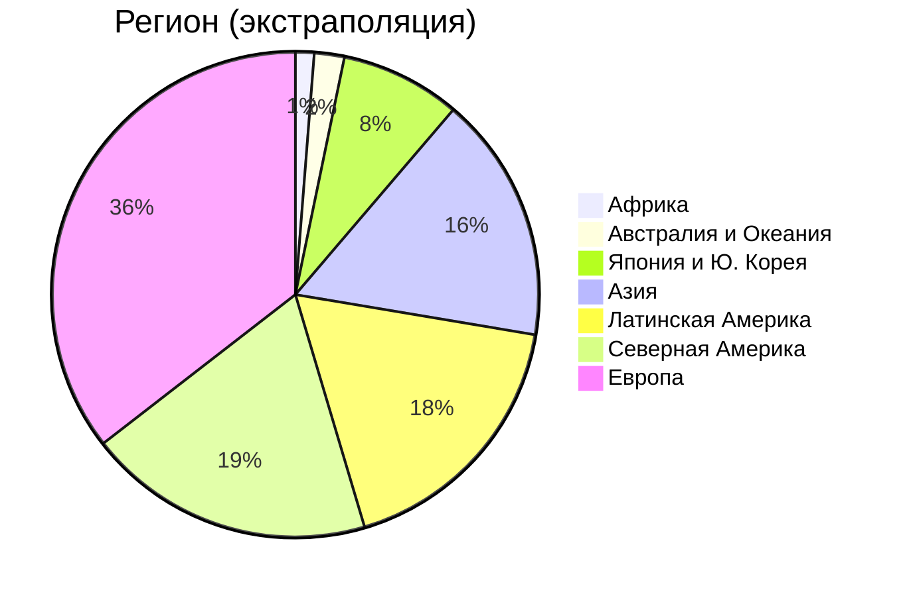
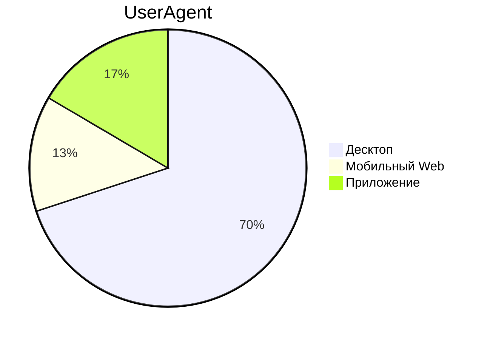
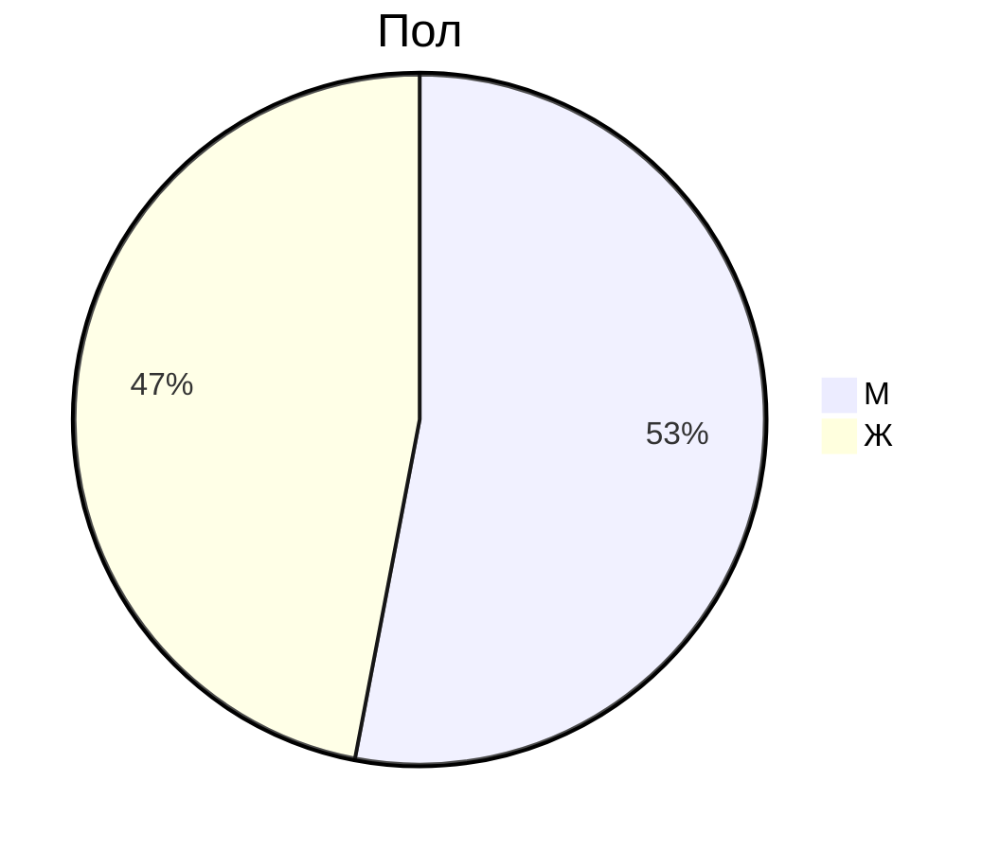

# 1. Тема и целевая аудитория

Google Drive - облачное B2C и B2B хранилище файлов

### Минимальный функционал

- Авторизация, регистрация;
- Загрузка файлов;
- Просмотр существующих файлов, их скачивание;
- Предварительный просмотр медиаконтента;
- Управление доступом;
- Поиск;
- Система ограничения доступного места.

### Ключевые продуктовые решения

- Сжатие медиаконтента при предварительном просмотре из браузера;
- Для поиска индексируются тексты документов, субтитры видео, сканы изображений;
- Возможность просматривать, создавать и изменять архивы через браузер;
- Возможность поделиться файлами по ссылке.

## Целевая аудитория

Данные взяты с HypeStat. [^1]

| K                              | V    |
| ------------------------------ | ---- |
| MAU                            | 2.0B |
| DAU                            | 100M |
| Зарегистрировано пользователей | 2.8B |

Другой информации о географии ЦА я не нашёл.
Имеющиеся данные были экстраполированы. [Ссылка на расчёт](calculations/regions.md)

### Основные продуктовые метрики

#### Исходные данные

В 2022 году на Google Drive было загружено 120 млрд файлов, или 1.4 эксабайт. [^2]

64% опрошенных пользователей хранят на диске фотографии, 50% - документы, 44% - архивы, 35% - видео. [^3]

# Список источников

[^1]: https://hypestat.com/info/drive.google.com (дата обращения: 23.02.2025)
[^2]: https://web.archive.org/web/20240626222045/https://techreport.com/statistics/software-web/gmail-statistics/ (дата обращения: 23.02.2025)
[^3]: https://www.statista.com/forecasts/1011667/file-types-google-one-google-drive-in-the-us
