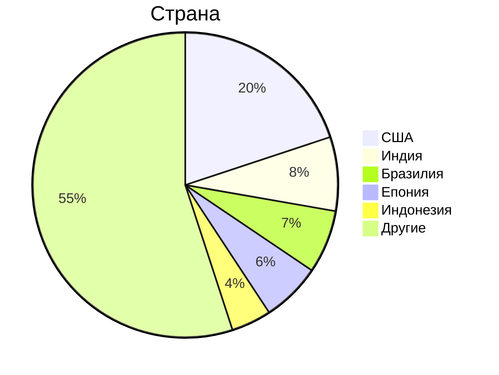
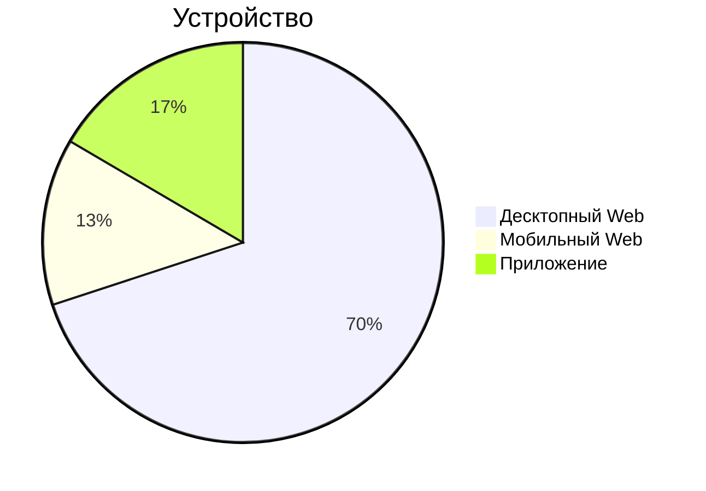
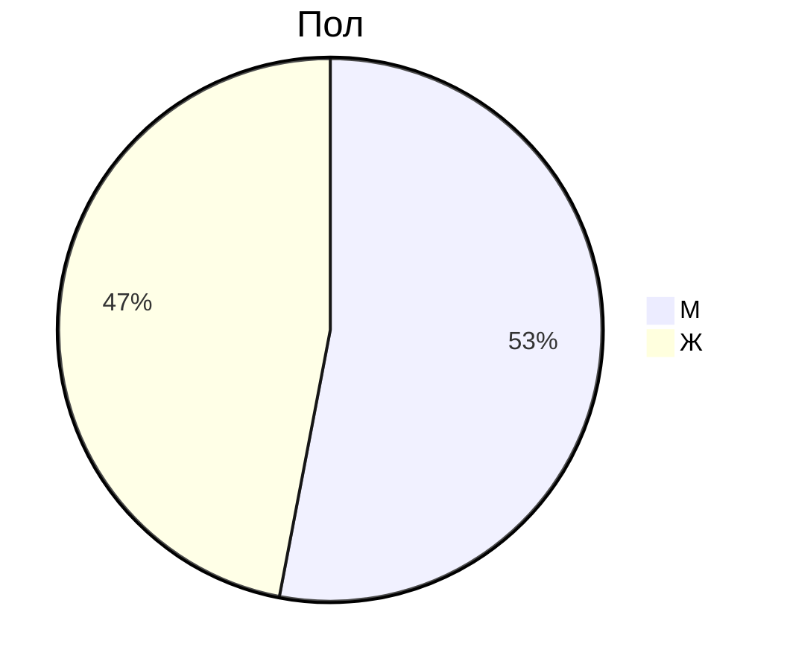

## Тема и целевая аудитория

Google Drive - облачное B2C и B2B хранилище файлов

### Минимальный функционал

- Загрузка файлов;
- Просмотр существующих файлов, их скачивание;
- Просмотр видео без скачивания (сжатого); просмотр фотографий без скачивания (сжатых);
- Управление доступом, sharing по ссылке;
- Поиск (по названию, по содержанию);
- Система ограничения доступного места.

### Целевая аудитория

Данные взяты с ExplodingTopics, SimilarWeb, HypeStat и некоторых других источников; несовпадающие значения усреднены.

> [!NOTE]
> Список источников находится в разработке, будет оформлен позже.

| K                              | V    |
| ------------------------------ | ---- |
| MAU                            | 2.0B |
| DAU                            | 100M |
| Зарегистрировано пользователей | 2.8B |

