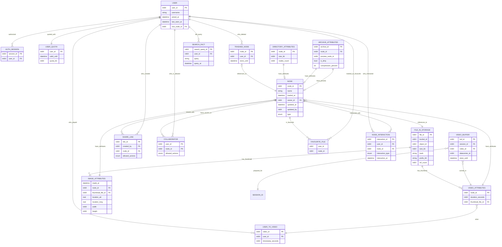

# 1. Тема и целевая аудитория

Google Drive - облачное B2C и B2B хранилище файлов

### Минимальный функционал

- Авторизация, регистрация;
- Загрузка файлов;
- Список последних файлов (стартовая страница);
- Просмотр существующих файлов, их скачивание;
- Предварительный просмотр медиаконтента;
- Управление доступом;
- Поиск;
- Система ограничения доступного места.

### Ключевые продуктовые решения

- Сжатие медиаконтента при предварительном просмотре из браузера;
- Для поиска индексируются тексты документов, субтитры видео, сканы изображений;
- Возможность просматривать, создавать и изменять архивы удалённо, без их скачивания
  (например, если надо в большой архив добавить один файл, пользователь присылает
  на сервер этот файл, а система автоматически дополнит архив);
- Возможность поделиться файлами по ссылке;
- Возможность просмотра папки с фотографиями в виде плиток с thumbnails;
- Возможность задавать разрешение видео при предварительном просмотре.

## Целевая аудитория

Данные взяты с HypeStat. [^1]

| K                              | V    |
| ------------------------------ | ---- |
| MAU                            | 2.0B |
| DAU                            | 100M |
| Зарегистрировано пользователей | 2.8B |

Другой информации о географии ЦА я не нашёл.
Имеющиеся данные были экстраполированы. [Ссылка на расчёт](calculations/regions.md)

# 2. Расчёт нагрузки

### Исходные данные

Данные и гипотезы об использовании диска

Месячная аудитория - 2.0 B; Дневная аудитория - 100 M

В 2022 году на Google Drive было загружено 250 млрд файлов, или 3.4 эксабайт. [^2]

Следовательно, средний размер файла - 13.6 Мб.

64% опрошенных пользователей хранят на диске фотографии, 50% - документы, 44% - архивы, 35% - видео. [^3]

В среднем пользователь использует 3.9 гигабайт для хранения файлов. [^4]

Пиковый трафик составляет 160% от среднесуточного.[^5]

Предположим, что 30% от объёма входящего контента - это видео, 20% - фотографии,
20% - архивы, остальное - другие файлы, не предполагающие особых режимов
доступа.

Предположим, что средний пользователь за день:

- Смотрит 10 фотографий;
- Смотрит 10 минут видео;
- Открывает главную страницу диска с последними файлами 2 раза;
- Открывает директорию, где много фотографий и надо считать thumbnails, 1 раз;
- Скачивает 2% от имеющихся файлов;
- Скачивает 1 раз папку в виде архива (размер архива - 0.5% от имеющихся файлов);
- Загружает в облако 1% от того объёма файлов, которые он имеет;
- Удаляет 0.5% от имеющихся файлов;
- Делится по ссылке 2 элементами (файлами или папками);
- Делает 10 запросов по работе с архивами (например, добавление файла в архив,
  загрузка конкретного файла из архива, удаление файла из архива)

Данные и гипотезы о размере медиаконтента

Растровое изображение, снятое на камеру смартфона в формате JPEG, весит в среднем
4 Мб. При предпросмотре такого изображения через Web-интерфейс облака загружается
в среднем 1.2 Мб.

Видео, снятое на камеру смартфона, имеет битрейт порядка 24 Мбит/с.

Битрейт потоковой передачи видео: 2,5 Мбит/с - видео YouTube с разрешением
720p (с кодированием H.264)[^6]. Google Drive использует те же технологии для передачи
видео, что и YouTube. Средний размер пакета с сегментом видео - 1.5 Мб.

Один thumbnail фотографии занимает 50 Кб.

### Продуктовые метрики (в пересчёте на пользователя)

Расчёт

Все данные приведены в пересчёте на пользователя в день.

Просмотр 10 фотографий = 12 Мб

Просмотр 10 минут видео = 190 Мб

Просмотр 1000 thumbnails = 50 Мб

Скачивание файлов = 58 Мб

Скачивание папки архивом = 19 Мб

Загрузка файлов на облако = 90 Мб (исходя из того, что ежегодно загружается
)

#### Хранение файлов

| Тип запроса              | Requests /User /Day | Data /User /Day |
| ------------------------ | ------------------- | --------------- |
| Добавление файла         | 7                   | 90 Мб           |
| Скачивание файла         | 6                   | 58 Мб           |
| Скачивание папки архивом | 2                   | 19 Мб           |

#### Предпросмотр медиаконтента

| Тип запроса         | Requests /User /Day | Data /User /Day |
| ------------------- | ------------------- | --------------- |
| Просмотр фотографий | 12                  | 12 Мб           |
| Просмотр видео      | 150                 | 190 Мб          |
| Просмотр thumbnails | 10                  | 10 Мб           |

#### Поиск и недавние

> [!WARNING]
> Расчёты трафика, приведённые в этой таблице, являются приблизительными
> и будут уточнены на этапе разработки схемы данных.

| Тип запроса            | Requests /User /Day | Data /User /Day |
| ---------------------- | ------------------- | --------------- |
| Полнотекстовый поиск   | 10                  | 300 Кб          |
| Список недавних файлов | 1                   | 20 Кб           |

#### Управление доступом

> [!WARNING]
> Расчёты трафика, приведённые в этой таблице, являются приблизительными
> и будут уточнены на этапе разработки схемы данных.

| Тип запроса                     | Requests /User /Day | Data /User /Day |
| ------------------------------- | ------------------- | --------------- |
| Изменение прав доступа          | 5                   | 8 Кб            |
| Получение списка файлов в папке | 50                  | 250 Кб          |

### Продуктовые метрики (в глобальном пересчёте)

Расчёт PPS

$$P = \frac{T}{1500 байт} + R\cdot 1.2$$,

где $P$ - количество пакетов, $T$ - объём переданной информации, $R$ - количество запросов

| Тип запроса                     | Трафик (avg)    | RPS (avg)  | Трафик (max)    | RPS (max)  |
| ------------------------------- | --------------- | ---------- | --------------- | ---------- |
| Добавление файла                | 837 Гбит/с      | 8050       | 1.34 Тбит/c     | 12880      |
| Скачивание файла                | 539 Гбит/с      | 6900       | 862.40 Гбит/с   | 11040      |
| Скачивание папки архивом        | 176 Гбит/с      | 2300       | 281.60 Гбит/с   | 3680       |
| Просмотр фотографий             | 112 Гбит/с      | 13800      | 179.20 Гбит/с   | 22080      |
| Просмотр видео                  | 1.77 Тбит/с     | 172500     | 2.83 Тбит/c     | 276000     |
| Просмотр thumbnails             | 93.0 Гбит/с     | 57500      | 148.80 Гбит/с   | 92000      |
| Полнотекстовый поиск            | 2.79 Гбит/с     | 11500      | 4.46 Гбит/с     | 18400      |
| Список недавних файлов          | 190 Мбит/с      | 1150       | 304 Гбит/с      | 1840       |
| Изменение прав доступа          | 74.0 Мбит/с     | 5750       | 118.40 Мбит/с   | 9200       |
| Получение списка файлов в папке | 2.33 Гбит/с     | 57500      | 3.73 Мбит/с     | 92000      |
| **Итого**                       | **3.53 Тбит/с** | **336950** | **5.65 Тбит/с** | **539120** |

### Размер хранилища

Средний размер хранилища для пользователя - 3.9 Гб.

Для простого хранения всех загруженных файлов (без репликации, кеширования, резервного
копирования) требуется 12 экзабайт.

# 3. Глобальная балансировка

## Функциональное разбиение по доменам

Google Drive использует очень много доменов для разных типов запросов

Для получения статических файлов:

- www.gstatic.com
- fonts.googleapis.com
- fonts.gstatic.com
- apis.google.com
- docs.google.com
- google.com

Для получения изображений и аватарок пользователей:

- lh3.googleusercontent.com

Для запросов информации о пользователях:

- people-pa.clients6.google.com
- drivefrontend-pa.clients6.google.com

Для запросов для работы с диском:

- drive.google.com

Для просмотра видео:

- c.drive.google.com (отсюда берутся сегменты видео)
- youtube.googleapis.com
- video.google.com

Для сбора аналитики и телеметрии:

- play.google.com

## Обоснования расположения ЦОД и влияние на продуктовые метрики

Требования к географическому расположению ЦОД:

- Demand: уверенность в востребованности ЦОДа;
- Необходимо, чтобы ЦОД располагался в географической близости к пользователям сервиса;
- Наличие широкополосных линий связи;
- Соответствие локальным законам (GDPR, 152-ФЗ);
- Обеспечение приемлемого качества сервиса.

Продуктовые метрики, на которые влияет географическое расположение ЦОД:

- Latency;
- Устойчивость к отказам сети;
- Стоимость обслуживания инфраструктуры;

### Оценка распределения пикового трафика по регионам

| Регион            | Трафик (max) |
| ----------------- | ------------ |
| Европа            | 2.0 Тбит/с   |
| Северная Америка  | 1.1 Тбит/с   |
| Латинская Америка | 1.0 Тбит/с   |
| Азия              | 900 Гбит/с   |
| Япония и Ю.Корея  | 450 Гбит/с   |
| Австралия         | 110 Гбит/с   |
| Африка            | 50 Гбит/с    |

### Предлагаемое расположение ЦОД

Евразия:

- Париж
- Осло
- Хельсинки
- Варшава
- Афины
- Сингапур
- Берлин
- Рим
- Стамбул
- Токио
- Нур-Султан
- Москва
- Новосибирск
- Нью-Дели

## Расчёт распределения запросов из секции «Расчёт нагрузки» по типам запросов по ЦОД

Балансировка по типам запросов обеспечивается за счёт использования множества доменов.

Для раздачи статических файлов следует использовать Anycast без DNS-балансировки.

Для запросов, которые требуют работу с базами данных, использовать DNS-балансировку.

## Схема DNS балансировки

Выберем Latency-Based DNS. В качестве провайдера выберем Google Cloud DNS.

# 4. Локальная балансировка

## Масштабирование Stateless-сервисов

Использовать Kubernetes auto-scaling.

В качестве Service Discovery использовать etcd.

## Схема балансировки для запросов на бэкенд

Запрос этого профиля идёт на единственный домен - drive.google.com.

Не использовать L4-балансировку.

В качестве L7-балансировщика использовать Envoy.

Почему не Nginx? Нужен активный пробинг, чтобы следить за здоровьем сервисов.

Схема L7-балансировки - Round Robin.

## Схема балансировки для отдачи пользователей файлов и видео, а также для загрузки файлов на облако

Запросы идут на следующие домены:

- c.drive.google.com
- lh3.googleusercontent.google.com

В качестве L4-балансировки использовать Virtual Server via Direct Routing.

В качестве L7-балансировщика использовать Envoy.

Почему не Nginx? Потому что веб-сервер должен работать с большими конфигурационными файлами.
Кеширование не требуется - пользователь запрашивает информацию редко и по одному разу.

Схема L7-балансировки - Least Connection.

## Схема балансировки для отдачи статики

Nginx как web-сервер.

Почему не Envoy? Потому что требуется кеширование.

В качестве L4-балансировки использовать Virtual Server via Direct Routing.

Не использовать L7-балансировку.

# 5. Логическая схема базы данных

Применяемые СУБД:

- YDB
- ElasticSearch
- Самописный S3 сервер
- Redis

<table>

<tr><th>Таблица</th><th>Описание</th><th>СУБД</th><th>Строк<th></tr>

<tr><td>User</td><td>Пользователь</td><td>YDB</td><td>$10^10$</td></tr>

<tr><td>AuthSession</td><td>Stateful-сессия пользователя</td><td>Redis</td><td>$10^10$</td></tr>

<tr><td>UserQuota</td><td>Кеш для внешнего сервиса биллинга</td><td>Redis</td><td>$10^10$</td></tr>

<tr><td>Node</td><td>Обычный файл или директория - аналог файла в Unix</td><td>Redis</td><td>$10^10$</td></tr>

<tr><td>FileInStorage</td><td>Файл, который хранится в объектном хранилище</td><td>Redis</td><td>$10^10$</td></tr>

<tr><td>TrashedNode</td><td>Файл, который находится в корзине</td><td>Redis</td><td>$10^10$</td></tr>

<tr><td>DirectoryAttributes</td><td>Атрибуты директории - только для файлов директорий</td><td>Redis</td><td>$10^10$</td></tr>

<tr><td>VideoAttributes</td><td>Атрибуты видео - только для файлов видео</td><td>Redis</td><td>$10^10$</td></tr>

<tr><td>ImageAttributes</td><td>Атрибуты изображения - только для файлов изображений</td><td>Redis</td><td>$10^10$</td></tr>

<tr><td>ArchiveAttributes</td><td>Атрибуты архива - только для файлов zip и rar и tar</td><td>Redis</td><td>$10^10$</td></tr>

<tr><td>ShareLink</td><td>Ссылка, по которой пользователь может просматривать файлы или присоединиться к работе
над директорией</td><td>Redis</td><td>$10^10$</td></tr>

<tr><td>Collaborator</td><td>Пользователь, который имеет права для данной директории</td><td>Redis</td><td>$10^10$</td></tr>

<tr><td>FavouriteFile</td><td>Файл, который пользователь пометил как избранный</td><td>Redis</td><td>$10^10$</td></tr>

<tr><td>NodeInteraction</td><td>Факт взаимодействия пользователя с файлом (для "недавних" файлов)</td><td>Redis</td><td>$10^10$</td></tr>

<tr><td>SearchFact</td><td>Факт совершения поискового запроса (для истории поиска)</td><td>Redis</td><td>$10^10$</td></tr>

<tr><td>VideoBuffer</td><td>Буфер видео на стороне сервера</td><td>Redis</td><td>$10^10$</td></tr>

<tr><td>VideoToUser</td><td>Информация о том, на какой временной метке остановился пользователь</td><td>Redis</td><td>$10^10$</td></tr>

</table>
# Список источников

[^1]: https://hypestat.com/info/drive.google.com (дата обращения: 23.02.2025)
[^2]: https://web.archive.org/web/20240626222045/https://techreport.com/statistics/software-web/gmail-statistics/ (дата обращения: 23.02.2025)
[^3]: https://www.statista.com/forecasts/1011667/file-types-google-one-google-drive-in-the-us (дата обращения: 23.02.2025)
[^4]: Результаты опроса, проведённого автором среди 8 человек: https://docs.google.com/spreadsheets/d/1Ivwkm36-tmMWPxk_14mbQxpYs6oTPlgk/edit (дата обращения: 23.02.2025)
[^5]: https://transparencyreport.google.com/traffic/overview?fraction_traffic=start:1740009600000;end:1740527999999;product:4;region:US&lu=fraction_traffic&hl=ru - данные о трафике от Google (дата обращения: 02.03.2025)
[^6]: https://ru.wikipedia.org/wiki/Битрейт (дата обращения: 02.03.2025)
