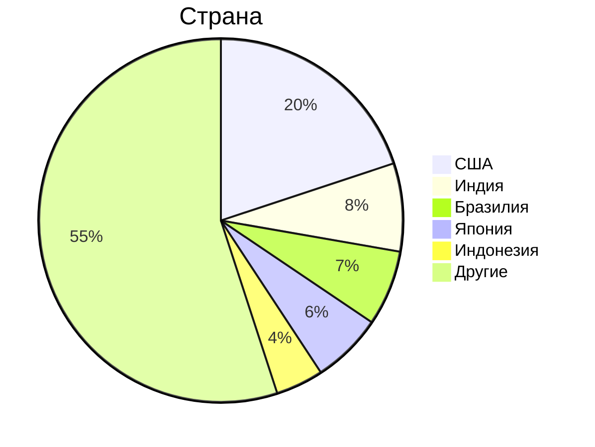
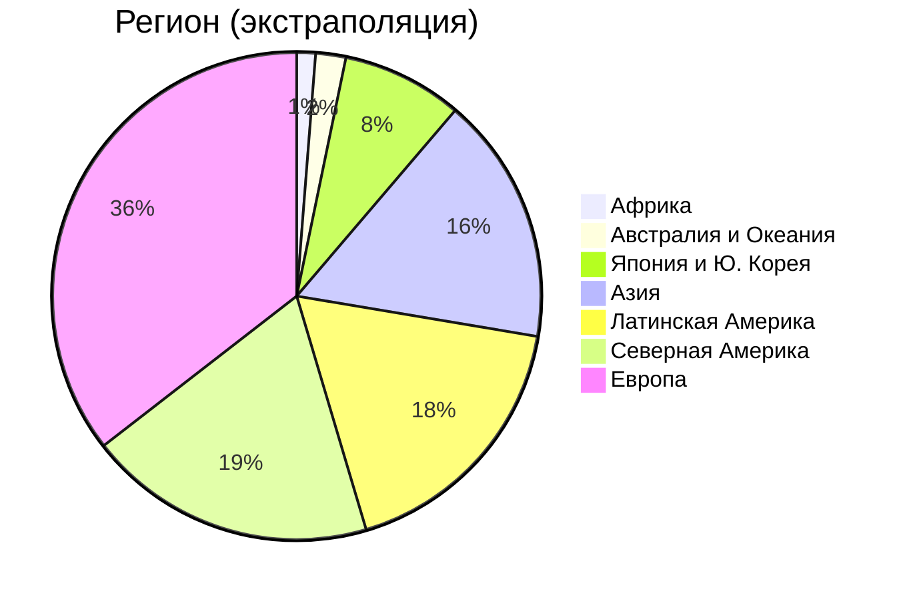

# Расчёт распределения пользователей по регионам на основании top-5 стран по количеству активных пользователей

#### Входные данные

#### Предположения о целевой аудитории

- В Китае сервис заблокирован;
- В Европе сервис использует такая же доля людей, как в США, потому что в Европе
нет сильных локальных конкурентов и потому что экономики похожи;
- В Африке плотность активных пользователей незначительная почти во всех странах;
в Марокко, Египте и ЮАР эта плотность на уровне Азии;
- В пределах одного региона во всех странах количество активных пользователей
на душу населения примерно одинаково.

#### Выделим в мире регионы

Пусть $N_i$ - население региона $i$, $A_i$ - количество активных пользователей (в пересчёте на MAU), а $\rho_i$ - количество активных пользователей на душу населения этого региона.

- Развивающиеся страны Азии (далее - Азия); $N_{Asia}\approx 2.6\ млрд$;
- Развитые страны Азии (далее - Япония); $N_{Japan}\approx0.19\ млрд$;
- Китай - нас не интересует;
- Европа - $N_{Europe}\approx 0.68\ млрд$;
- Центральная и Южная Америка - $N_{LA}\approx 0.62\ млрд$;
- Африка (страны с активным трафиком) - $N_{Africa}\approx 0.2\ млрд$;=
- Австралия и Океания - $N_{AU}\approx 0.038\ млрд$;
- Северная Америка - $N_{NA}\approx 0.36\ млрд$.

Здесь из населения Азии исключены Япония и Южная Корея, потому что эта страна значительно выделяется
среди других стран.

#### Рассчитаем $\rho_i$ для известных стран

$\rho_{NA} \approx \frac{400\ млн}{330\ млн} \approx 1.18$ (на основании США для Северной Америки)

$\rho_{Japan}\approx \frac{120 млн}{120 млн}\approx 1$

$\rho_{Europe} \approx \rho_{AU} \approx \rho_{NA}=1.18$ (на основании предположений о ЦА)

$\rho_{LA}\approx\frac{140\ млн}{220\ млн}\approx0.636$ (на основании Бразилии)

$\rho_{Asia}\approx \frac{160\ млн + 80\ млн}{1.4\ млрд + 0.28\ млрд}\approx0.142$ (на основании Индии и Индонезии)

$\rho_{Africa}\approx 0.142$ (на основании предположений о ЦА)

#### Экстраполируем $A_i$

$A_{Africa}\approx 0.028\ млрд$

$A_{NA} \approx 0.43\ млрд$

$A_{Europe} \approx 0.80\ млрд$

$A_{AU} \approx 0.045\ млрд$

$A_{LA} \approx 0.4\ млрд$

$A_{Asia} \approx 0.37\ млрд$

#### Результат расчёта

